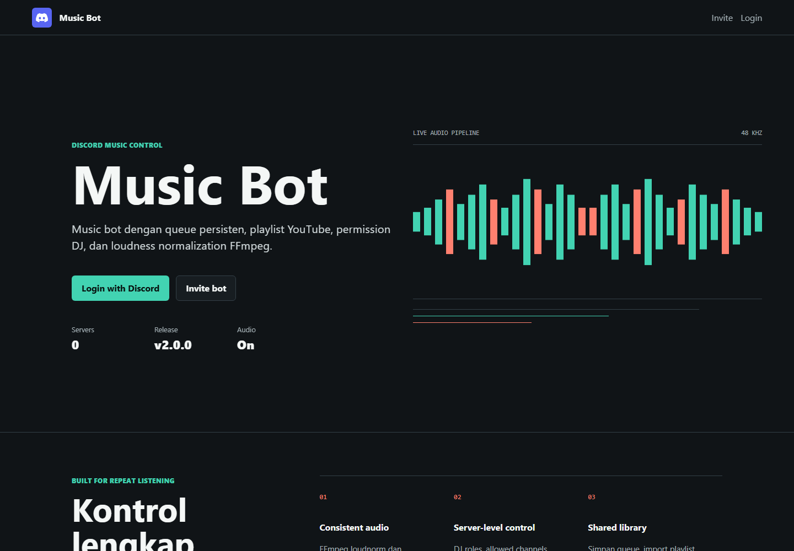

<div align="center">

<h1>Discord Rust Music Bot</h1>

<p><strong>A production-minded Discord music bot with consistent audio, persistent queues, and a per-server web dashboard.</strong></p>

<p>
  <a href="https://github.com/MKRyuto/discord-rust-music-bot/releases"></a>
  <a href="https://www.rust-lang.org/"></a>
  <a href="LICENSE"></a>
  <a href="https://github.com/MKRyuto/discord-rust-music-bot/stargazers"></a>
  <a href="https://github.com/MKRyuto/discord-rust-music-bot/commits/main"></a>
</p>

<p>
  <a href="#features">Features</a> |
  <a href="#quick-start">Quick Start</a> |
  <a href="#documentation">Documentation</a> |
  <a href="docs/DEPLOYMENT.md">Deployment</a>
</p>

</div>




## Overview

Discord Rust Music Bot combines slash-command playback, interactive Discord panels, and an authenticated web dashboard. Each server gets its own queue, playlists, permissions, playback settings, statistics, and audit history.

The audio pipeline resolves YouTube sources with `yt-dlp`, plays them through Songbird, and can apply FFmpeg loudness normalization so users do not need to keep changing their volume between tracks.

## Features

| Audio and playback               | Library and queue                    | Dashboard and control          |
| -------------------------------- | ------------------------------------ | ------------------------------ |
| FFmpeg loudness normalization    | Persistent per-server queues         | Discord OAuth2 login           |
| Play, seek, replay, and previous | Reorder, search, and multi-remove    | Live playback updates with SSE |
| Loop, shuffle, and autoplay      | Manual editor and YouTube imports     | Player and queue controls      |
| Playback recovery and idle leave | History and user/server statistics   | DJ roles and allowed channels  |
| Volume settings per server       | Per-user cooldown and queue limits   | Blocklist and audit log        |
| Vote skip for voice listeners    | SQLite persistence                   | Privacy and Terms pages        |

Additional highlights:

- Slash commands only; no message-content intent required.
- Interactive player and queue panels with buttons and select menus.
- Queue and settings survive normal process restarts.
- Dynamic website identity from the connected Discord bot profile.
- Encrypted persistent OAuth sessions, CSRF protection, security headers, and rate limiting.
- SQLite WAL mode with busy-write protection and scheduled online backups.
- Public user documentation at `/docs` with searchable command reference.

## Stack

| Layer         | Technology                         |
| ------------- | ---------------------------------- |
| Bot framework | Poise + Serenity                   |
| Voice         | Songbird + Symphonia               |
| Audio source  | yt-dlp + FFmpeg                    |
| Web           | Axum + server-rendered HTML/CSS/JS |
| Storage       | SQLite through rusqlite            |
| Runtime       | Tokio                              |

## Quick Start

Install Rust, FFmpeg, and yt-dlp, then create the local environment file:

```powershell
Copy-Item .env.example .env
```

At minimum, configure the Discord bot token and application values in `.env`, then run:

```powershell
cargo run
```

The dashboard is available at `http://127.0.0.1:3000` by default. Discord OAuth requires the matching callback URL:

```text
http://127.0.0.1:3000/auth/callback
```

For the complete Discord Developer Portal, OAuth, environment, reverse proxy, and production checklist, read the [Deployment Guide](docs/DEPLOYMENT.md).

## Documentation

- **User guide:** open `/docs` on the running dashboard for features, commands, dashboard usage, and permissions.
- **Operator guide:** [docs/DEPLOYMENT.md](docs/DEPLOYMENT.md) covers installation and deployment.
- **Configuration template:** [.env.example](.env.example) lists every supported environment variable.
- **Discord help:** use `/help` for the interactive in-server command menu.

## Development

Run the same checks used before release:

```powershell
cargo fmt --all -- --check
cargo clippy --all-targets --all-features -- -D warnings
cargo test
cargo build --release
```

Preview only the public website without connecting a Discord client:

```env
WEB_PREVIEW=true
WEB_ENABLED=true
```

Never enable preview mode in a production bot deployment.

## Project Layout

```text
src/
|-- commands/       Slash commands
|-- interactions/   Discord component handlers
|-- music/          Playback, queue, and track state
|-- ui/             Discord player and queue panels
|-- web/            Dashboard CSS, JavaScript, and docs content
|-- storage.rs      SQLite persistence
|-- web.rs          HTTP routes, OAuth, and dashboard handlers
`-- main.rs         Bot startup and command registration
```

## Security

Do not commit `.env`, the SQLite database, Discord tokens, OAuth secrets, or `SESSION_SECRET`. Public deployments must use HTTPS and a stable session secret. See the [security checklist](docs/DEPLOYMENT.md#production-checklist).

## License

Licensed under the [MIT License](LICENSE).
